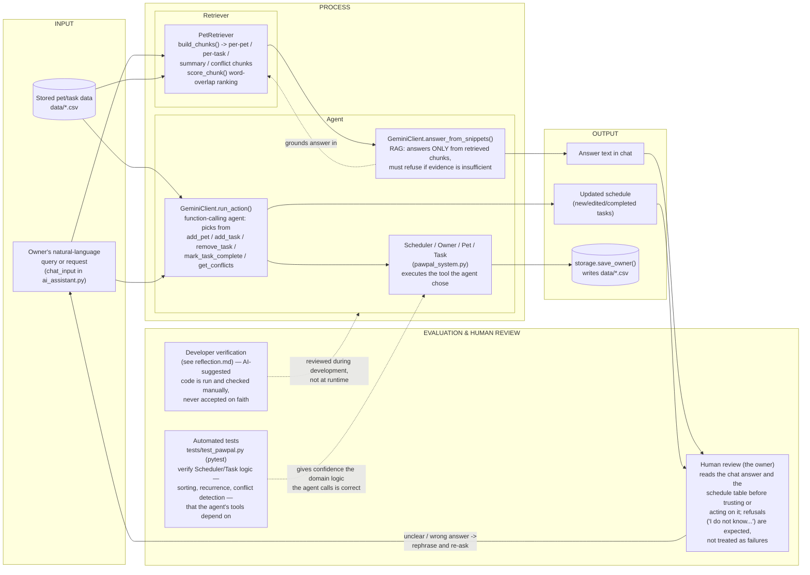

# PawPal+ AI Assistant

## Original Project (Modules 1–3)

This repo started as **PawPal+**, a Module 2 project: a Streamlit app that helps a pet owner track care tasks (walks, feeding, meds, grooming) across multiple pets. The original goal was a plain-Python domain model — `Owner`, `Pet`, `Task`, `Scheduler` — that could sort tasks by priority or time, filter by pet or completion status, detect scheduling conflicts, and auto-reschedule recurring tasks, all wired up to a basic CRUD UI. No AI was involved at that stage; it was pure object-oriented design and testable business logic, built from a UML draft first (`diagrams/uml_draft.mmd`, `diagrams/uml_final.mmd`).

This project takes that same domain model and layers an applied-AI system on top of it, without changing the underlying scheduling logic.

## Title & Summary

**PawPal+ AI Assistant** adds a Gemini-powered chat layer to PawPal+ so an owner can ask questions about their pets' schedule in plain English ("what does Mochi have today?") and, separately, ask the assistant to actually manage the schedule for them ("add a daily 7am walk for Mochi") instead of clicking through forms. It matters because it's a small, self-contained example of two AI patterns that show up constantly in real systems: **retrieval-augmented generation** grounded in an owner's own data (so the model can't hallucinate a pet that doesn't exist), and an **agent with tool access** that's allowed to call real, side-effect-having functions instead of just producing text. Both patterns sit on top of the same deterministic, unit-tested `Scheduler`, so the AI is a UI convenience layered over trusted logic, not a replacement for it.

## Architecture Overview

The system has four layers: a Streamlit **UI** layer, a plain-Python **domain** layer (`pawpal_system.py`), an **AI** layer (`pet_retriever.py` + `llm_client.py`) that talks to Gemini, and a CSV **persistence** layer (`storage.py`). The domain layer has zero dependency on Streamlit or Gemini, so the core app runs and passes its full test suite with no API key at all — the AI Assistant page is the only thing that needs one.

Two things flow through the AI layer, and they're kept deliberately separate:

- **Retriever → RAG agent (read-only):** `PetRetriever` turns the owner's live pet/task data into small text chunks (per-pet, per-task, an aggregate summary, and a conflicts chunk). `GeminiClient.answer_from_snippets()` answers a question using *only* those chunks and is instructed to refuse ("I do not know based on the current schedule.") when the evidence isn't there.
- **Function-calling agent (has side effects):** `GeminiClient.run_action()` gives Gemini six real tools bound to the current owner — `add_pet`, `remove_pet`, `add_task`, `remove_task`, `mark_task_complete`, `get_conflicts` — and lets the model decide which to call. The tools *are* `Scheduler`/`Owner`/`Pet` methods, so anything the agent does is exactly as correct as the code those tests already cover.

The full system diagram (retriever → agent → output, plus where automated tests and human review check the AI's work) is below and also lives at [diagrams/ai_system_diagram.mmd](diagrams/ai_system_diagram.mmd):



For a deeper breakdown (class diagram, load/save data flow, per-flow sequence diagrams, and the Gemini retry/error handling logic), see [diagrams/architecture.md](diagrams/architecture.md).

## Setup Instructions

```bash
# 1. Clone and enter the repo
git clone <this-repo-url>
cd applied-ai-system-project

# 2. Create and activate a virtual environment
python -m venv .venv
source .venv/bin/activate        # Windows: .venv\Scripts\activate

# 3. Install dependencies
pip install -r requirements.txt

# 4. Add your Gemini API key
#    Get a free key at https://aistudio.google.com/apikey
echo "API_KEY=your-gemini-api-key-here" > .env

# 5. Run the app
streamlit run app.py
```

Once it's running: go to the **Main Page**, set an owner name, add a pet or two, and add some tasks. Then switch to the **AI Assistant** page in the sidebar to chat with it. A mode toggle at the top of the chat switches between **"Ask a question"** (read-only, grounded in the owner's data) and **"Make a change"** (lets the AI call `add_pet`/`add_task`/`remove_task`/`mark_task_complete`/`get_conflicts` and saves the result). The AI Assistant page works only when `API_KEY` is set; everything else (scheduling, sorting, conflict detection, CSV persistence) works with no key at all.

To run the CLI demo (no Streamlit, no API key needed) or the test suite:

```bash
python main.py
python -m pytest tests/test_pawpal.py -v
```

## Sample Interactions

These are real transcripts captured against the live Gemini API using an actual saved owner ("Jordan," with pets Mochi, Mitt, and Mushu), not hand-written examples. The RAG examples (1–2) go through the chat's "Ask a question" mode; the agent examples (3–4) go through "Make a change," which calls `GeminiClient.run_action()` and persists the result with `storage.save_owner()` exactly as the chat page does.

**1. RAG question — multi-task lookup for one pet**

> **Input:** `What tasks does Mitt have and are any of them recurring?`
>
> **Output:**
> Based on the records, Mitt has three tasks, and two of them are recurring:
> 1. **Walk**: Described as "Walk around the block" and scheduled for 2026-07-19 at 09:00 AM. **Yes, this is recurring** (it repeats every week).
> 2. **Belly Scritches**: Described as "Scritch the kitty" and scheduled for 2026-07-19 at 12:00 PM. **Yes, this is recurring** (it repeats every day).
> 3. **Vet**: Described as "Take Mitt to vet" and scheduled for 2026-07-19 at 04:00 PM. **No, this is not recurring** (it is a one-time task that does not repeat).
>
> I relied on the following records for this information: `Mitt (profile)`, `Mitt: Walk`, `Mitt: Belly Scritches`, `Mitt: Vet`.

**2. RAG question — aggregate count**

> **Input:** `How many pets does Jordan have and what are their names?`
>
> **Output:** Based on the **Owner Summary** record, Jordan has 3 pets named Mochi, Mitt, and Mushu.

This one only works cleanly because of the precomputed "Owner Summary" chunk (see [pet_retriever.py](pet_retriever.py)) — without it, no single per-pet or per-task chunk actually answers a count question, since counting requires reasoning over the whole collection, not one record.

**3. Agent action — adds a real task**

> **Input:** `Add a low priority task for Mushu called Afternoon Nap Check at 3pm, one-time, due 2026-07-20`
>
> **Output:** I have successfully added the task "Afternoon Nap Check" for Mushu. It is scheduled for 3:00 PM on July 20, 2026, with low priority and no recurrence.

Verified independently of the model's own claim: after the call returned, `owner.get_pets()` showed Mushu's task list as `['Milking', 'Afternoon Nap Check']` — the tool call actually ran, it didn't just describe running.

**4. Agent action — read-only tool call**

> **Input:** `What scheduling conflicts do we currently have?`
>
> **Output:** Based on the current schedule, you do not have any scheduling conflicts. All of the tasks are scheduled at different times: 07:00 AM Morning Walk (Mochi), 09:00 AM Walk (Mitt), 12:00 PM Belly Scritches (Mitt), 01:00 PM Milking (Mushu), 04:00 PM Vet (Mitt), 03:00 PM (Jul 20) Afternoon Nap Check (Mushu).

This calls `get_conflicts()` — a tool with no side effects — showing the same function-calling mechanism handles both mutations and pure queries.

## Design Decisions

- **Domain logic has no AI/UI dependency.** `pawpal_system.py` imports neither `streamlit` nor `google.genai`. This means the scheduling logic (the part most likely to have subtle bugs) can be unit-tested in isolation, and the app degrades gracefully — no API key just means no chat page, not a broken app.
- **RAG and agent actions are two separate methods, not one mega-prompt.** `answer_from_snippets` is intentionally read-only and grounded; `run_action` is intentionally the only path that can mutate data. Keeping them apart made it easy to reason about what a "just asking a question" flow can and can't do versus a "do this for me" flow, and to write a stricter refusal rule for the former without it interfering with the latter.
- **The chat page passes *all* of an owner's chunks as context instead of a filtered top-k.** `PetRetriever.retrieve()` and `has_sufficient_evidence()` exist and work, but one owner's dataset is a handful of pets and tasks, not a real document corpus. Narrowing context via retrieval actually caused false refusals on legitimate cross-pet or aggregate questions that no single chunk could answer alone — so full context won out over "proper" RAG at this scale. That trade-off would flip for an owner with hundreds of tasks.
- **CSV is the single source of truth; the in-memory object graph is never trusted across reruns.** Streamlit reruns the whole script on every interaction, so instead of trying to keep session state and disk in sync, `storage.py` rebuilds the `Owner` graph from CSV every time, cached only by `(name, data_version)` where `data_version` is a max-mtime stamp. Any save invalidates the cache automatically with no manual cache-busting.
- **Gemini call failures are classified, not just retried blindly.** `GeminiClient._generate_content()` retries transient `ServerError`s (503s) with backoff, but treats a 429 (quota/rate limit) as terminal immediately — retrying an already-exhausted quota just wastes time and fails again. Every failure surfaces as a `GeminiAPIError` with a message written to be shown directly to the user, rather than being silently swallowed into a normal-looking answer.
- **Conflict detection is exact-time-slot matching, not duration-aware overlap.** `get_conflicts()` only flags two tasks as conflicting if they share the identical `(due_date, time)`. Real overlap detection needs a `duration` field that doesn't exist on `Task` yet, and adding one touches the constructor, the UI form, sorting, and recurrence — too much for this pass. The trade-off is documented in `reflection.md` along with how it'd be added later.

## Testing Summary

The domain layer has a real automated test suite (`tests/test_pawpal.py`, 6 tests, all passing):

| Test | What it verifies |
|------|-------------------|
| `test_mark_complete_changes_status` | `completion_status` flips to `True` after `mark_complete()` |
| `test_add_task_increases_pet_task_count` | `add_task` appends to the pet's task list |
| `test_sort_by_time_returns_chronological_order` | `build_schedule(sort_key="time")` orders by date then time, ignoring priority |
| `test_daily_recurrence_creates_next_day_task` | Completing a `"daily"` task creates a next-occurrence task due the next day |
| `test_get_conflicts_flags_same_time_slot` | Two tasks in the same `(date, time)` slot produce a cross-pet warning |
| `test_get_conflicts_no_warning_for_different_times` | Tasks at different times produce no warnings |

**What worked:** the scheduling logic — sorting, recurrence chaining, conflict detection — is fully covered and behaves predictably, which mattered more than testing the AI layer because it's the part every other feature (including the agent's tools) depends on.

**What didn't get automated coverage:** weekly recurrence, `filter_by_pet` with a nonexistent name, the same-pet conflict variant, and misspelled/unknown priority values sorting to the end — those code paths exist but aren't asserted on yet. More importantly, **there is no automated evaluator for the LLM's actual output** — no golden-answer comparison, no LLM-as-judge. The check on whether a chat answer or agent action was *correct* is a human reading it (see the system diagram above), which is fine for a course project but is the first gap I'd close before trusting this with real data at scale.

**What I learned:** AI-generated suggestions have to be run, not just read. One concrete example — when adding the "Remove Pet" button, an AI-suggested `st.success()` message placed right before `st.rerun()` never actually appeared, because `st.rerun()` wipes everything rendered in that pass before the user ever sees it. Reading the code, it looked correct. Only running it revealed the bug. That habit — verify by execution, not by inspection — is the main testing takeaway from this project.

## Reflection

Building the AI layer on top of an already-tested domain model made the trade-offs much easier to see: because `Scheduler` was already correct and covered, every AI design question reduced to "how do I get Gemini to call the right existing method with the right arguments," not "is the underlying logic even right." That separation — trusted deterministic core, thin AI layer on top, human as the last check on the AI's output — is the main thing I'd carry into a bigger project. The full responsible-AI collaboration reflection (specific helpful vs. flawed AI suggestions, and system limitations) is in `model_card.md`, not here.
