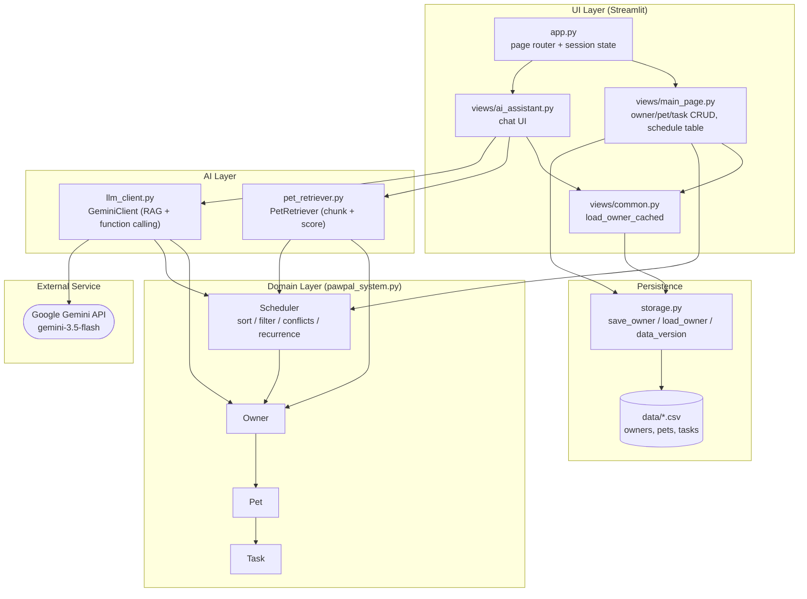
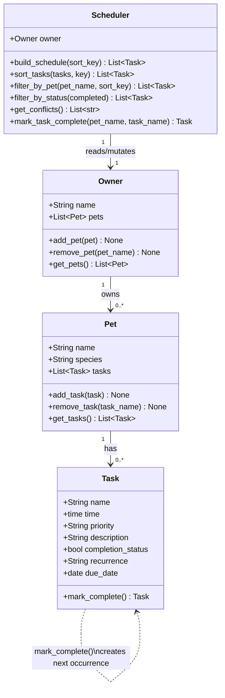
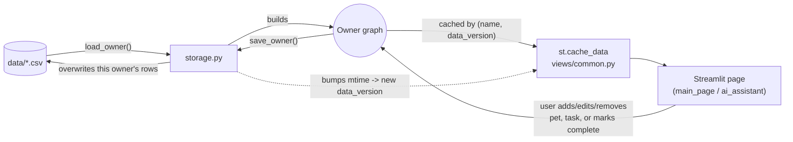
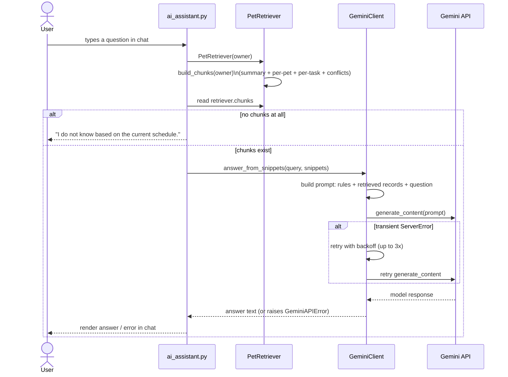
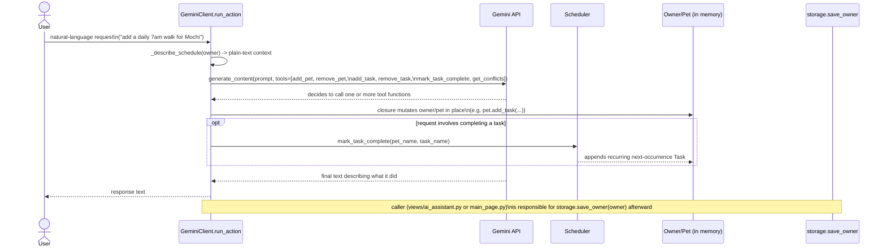
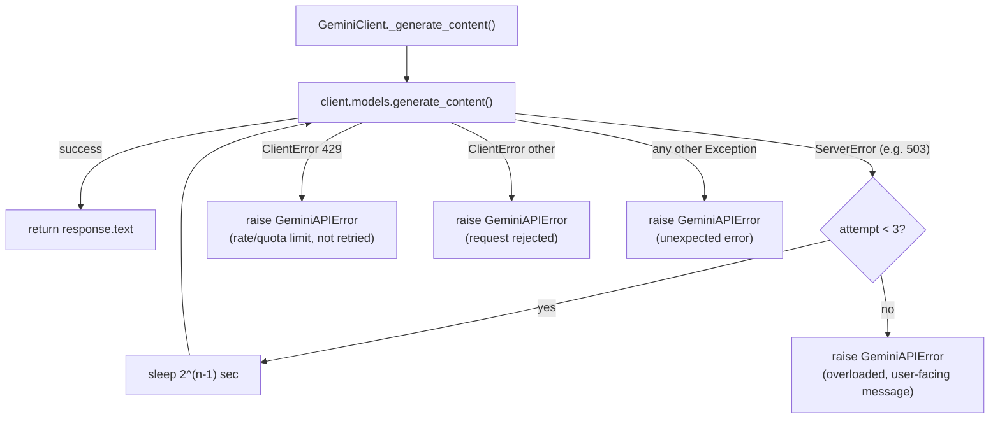

# PawPal+ Architecture

PawPal+ is a Streamlit app for planning pet-care tasks, with an AI assistant
layered on top of a plain-Python domain model. Data persists to CSV files.
This document diagrams the system from four angles: layers, domain model,
runtime flows, and file layout.

## 1. System layers

**Notes**
- `app.py` only wires up navigation and session state; it holds no business logic.
- The domain layer (`pawpal_system.py`) has zero dependency on Streamlit or Gemini — it's pure Python and is what `tests/test_pawpal.py` exercises directly.
- The AI layer depends on the domain layer (it reads/mutates `Owner`/`Scheduler`) but the domain layer has no reverse dependency, so PawPal+ works fully without an API key (AI Assistant page just can't run).
- `storage.py` is the only module that touches the filesystem for app data; CSVs are the source of truth and the in-memory `Owner` graph is rebuilt from them on every rerun.

## 2. Domain model (class diagram)

`Scheduler` is stateless business logic over an `Owner`'s pet/task graph: it
never stores its own copy of tasks, it always recomputes from
`owner.get_pets()`. Recurrence (`daily`/`weekly`) is modeled by
`Task.mark_complete()` returning a brand-new `Task` for the next occurrence
rather than mutating dates in place.

## 3. Data flow: load / edit / save cycle

Because the cache key includes `storage.data_version()` (a max mtime across
the three CSVs), any save invalidates the cache automatically — there's no
manual cache-busting logic, and every Streamlit rerun rebuilds the object
graph fresh from disk rather than trusting session state to stay in sync.

## 4. AI Assistant: RAG flow (`answer_from_snippets`)

The assistant currently passes **all** of an owner's chunks as context
(rather than a filtered top-k) — a deliberate choice noted in
`views/ai_assistant.py` because one owner's dataset is small enough that
narrowing context via retrieval caused false refusals. `PetRetriever.retrieve`
and `has_sufficient_evidence` remain available for narrower lookups.

## 5. AI Assistant: agentic action flow (`run_action`, function calling)

The six tool functions (`add_pet`, `remove_pet`, `add_task`, `remove_task`,
`mark_task_complete`, `get_conflicts`) are plain Python closures bound to one
specific `owner`, passed straight to Gemini's `tools=` config — Gemini
decides which to call based on the request, and `run_action` mutates the
real `Owner` object graph as a side effect.

## 6. Error handling in the LLM layer

`GeminiAPIError` messages are written to be shown directly to the end user
(not swallowed as an internal detail), so callers in the UI layer just catch
it and render `str(e)`.

## 7. Project file layout

```mermaid
flowchart TB
    root["applied-ai-system-project/"]
    root --> app_py["app.py — Streamlit entrypoint, page router"]
    root --> main_py["main.py — CLI demo of Scheduler (no Streamlit/AI)"]
    root --> pawpal["pawpal_system.py — Owner, Pet, Task, Scheduler"]
    root --> storage_py["storage.py — CSV persistence"]
    root --> retriever_py["pet_retriever.py — PetRetriever (RAG chunking/scoring)"]
    root --> llm_py["llm_client.py — GeminiClient (RAG + function-calling agent)"]
    root --> views["views/"]
    views --> vmain["main_page.py — owner/pet/task CRUD + schedule UI"]
    views --> vai["ai_assistant.py — chat UI"]
    views --> vcommon["common.py — load_owner_cached (shared cache)"]
    root --> data["data/"]
    data --> owners_csv["owners.csv"]
    data --> pets_csv["pets.csv"]
    data --> tasks_csv["tasks.csv"]
    root --> tests["tests/test_pawpal.py — Scheduler/Task unit tests"]
    root --> diagrams["diagrams/ — uml_draft.mmd, uml_final.mmd, architecture.md"]
    root --> reflection["reflection.md, ai_interactions.md, README.md"]
    root --> env[".env — API_KEY for Gemini"]
```

